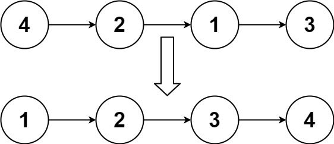

### 排序链表

​	日期：2021-06-01

题目：

给你链表的头结点 head ，请将其按 升序 排列并返回 排序后的链表 。

进阶：

你可以在 O(n log n) 时间复杂度和常数级空间复杂度下，对链表进行排序吗？


例1：



```
输入：head = [4,2,1,3]
输出：[1,2,3,4]
```


例2：


```
输入：head = [-1,5,3,4,0]
输出：[-1,0,3,4,5]
```


例3：

```
输入：head = []
输出：[]
```


题解：

**归并排序**

```c++
/**
 * Definition for singly-linked list.
 * struct ListNode {
 *     int val;
 *     ListNode *next;
 *     ListNode() : val(0), next(nullptr) {}
 *     ListNode(int x) : val(x), next(nullptr) {}
 *     ListNode(int x, ListNode *next) : val(x), next(next) {}
 * };
 */
class Solution {
public:
   ListNode* sortList(ListNode* head) {
		if (head == nullptr || head->next == nullptr)
		{
			return head;
		}

		ListNode* midNode = middleNode(head);
		ListNode* rightNode = midNode->next;
		midNode->next = nullptr;

		ListNode* left = sortList(head);
		ListNode* right = sortList(rightNode);

		return sort(left, right);
	}

	ListNode* middleNode(ListNode* node)
	{
		ListNode* slow = node;
		ListNode* fast = node->next;

		while (fast != nullptr && fast->next != nullptr)
		{
			slow = slow->next;
			fast = fast->next->next;
		}

		return slow;
	}

	ListNode* sort(ListNode* left, ListNode* right)
	{
		ListNode* pHead = new ListNode(0);
		ListNode* head = pHead;

		while (left && right)
		{
			if (left->val < right->val)
			{
				head->next = left;
				left = left->next;
			}
			else
			{
				head->next = right;
				right = right->next;
			}

			head = head->next;
		}

		head->next = left != nullptr ? left : right;
		return pHead->next;
	}
};
```


https://leetcode-cn.com/problems/sort-list/