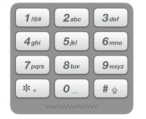

### 电话号码的字母组合

题目：

给定一个仅包含数字 2-9 的字符串，返回所有它能表示的字母组合。答案可以按 任意顺序 返回。

给出数字到字母的映射如下（与电话按键相同）。注意 1 不对应任何字母。





例1：

```
输入：digits = "23"
输出：["ad","ae","af","bd","be","bf","cd","ce","cf"]
```


例2：

```
输入：digits = ""
输出：[]
```


例3：

```
输入：digits = "2"
输出：["a","b","c"]
```


题解：

**回溯算法**：

```c++
class Solution {
public:
    vector<string> letterCombinations(string digits) {
        std::vector<std::string> result;

		if (digits.empty())
		{
			return result;
		}

		std::unordered_map<char, std::string> standard ={ { '2', "abc" },
														  { '3', "def" },
														  { '4', "ghi" },
														  { '5', "jkl" },
														  { '6', "mno" },
														  { '7', "pqrs" },
														  { '8', "tuv" },
														  { '9', "wxyz" } };

		std::string szStr;

		backTrack(result, digits, szStr, standard, 0);

		return result;
    }

	void backTrack(std::vector<std::string>& result, std::string digits, std::string szStr, std::unordered_map<char, 
		std::string> standard, int nIndex)
	{
		if (nIndex == digits.size())
		{
			result.push_back(szStr);
			return;
		}

		std::string szLetters = standard[digits[nIndex]];

		for (char chLetter : szLetters)
		{
			szStr.push_back(chLetter);
			backTrack(result, digits, szStr, standard, nIndex + 1);
			szStr.pop_back();
		}
	}
};
```


https://leetcode-cn.com/problems/letter-combinations-of-a-phone-number/