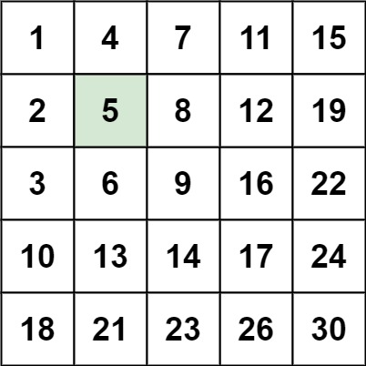

### 搜索二维矩阵II

题目：

编写一个高效的算法来搜索 m x n 矩阵 matrix 中的一个目标值 target 。该矩阵具有以下特性：

每行的元素从左到右升序排列。
每列的元素从上到下升序排列。


例1：



```
输入：matrix = [[1,4,7,11,15],[2,5,8,12,19],[3,6,9,16,22],[10,13,14,17,24],[18,21,23,26,30]], target = 5
输出：true
```


例2：


```
输入：matrix = [[1,4,7,11,15],[2,5,8,12,19],[3,6,9,16,22],[10,13,14,17,24],[18,21,23,26,30]], target = 20
输出：false
```


提示：

```
m == matrix.length
n == matrix[i].length
1 <= n, m <= 300
-109 <= matix[i][j] <= 109
每行的所有元素从左到右升序排列
每列的所有元素从上到下升序排列
-109 <= target <= 109
```


题解：

**二分查找**：

```c++
class Solution {
public:
    bool searchMatrix(vector<vector<int>>& matrix, int target)
    {
		for (int i = 0; i < matrix.size(); i++)
		{
			if (binarySearch(matrix[i], target))
			{
				return true;
			}
		}

		return false;
	}

	bool binarySearch(vector<int>& nums, int target)
	{
		int nLeft = 0;
		int nRight = nums.size() - 1;

		while (nLeft <= nRight)
		{
			int nMid = nRight - (nRight - nLeft) / 2;

			if (nums[nMid] == target)
			{
				return true;
			}

			if (nums[nMid] > target)
			{
				nRight = nMid - 1;
			}
			else
			{
				nLeft = nMid + 1;
			}
		}

		return false;
	}
};
```


**看成二叉搜索树进行查找**：

```c++
class Solution {
public:
    bool searchMatrix(vector<vector<int>>& matrix, int target) {
        int nCol = matrix[0].size() - 1;
		int nRow = 0;

		while (nRow <= matrix.size() - 1 && nCol >= 0)
		{
			if (matrix[nRow][nCol] < target)
			{
				nRow++;
			}
			else if (matrix[nRow][nCol] > target)
			{
				nCol--;
			}
			else
			{
				return true;
			}
		}

		return false;
    }
};
```


https://leetcode-cn.com/problems/search-a-2d-matrix-ii/