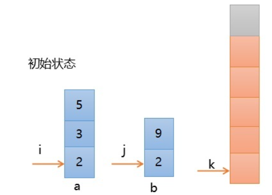
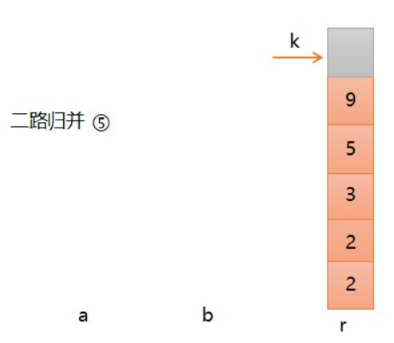
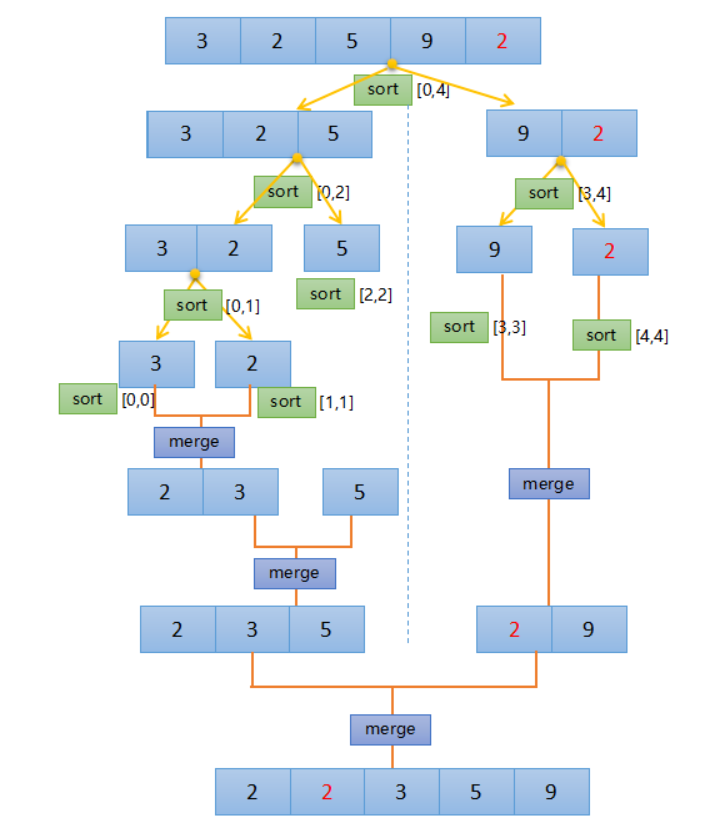

### 归并排序

归并排序是分而治之思想的典型应用。

**算法的核心概念—二路归并**
若将两个有序表合并成一个有序表，称为二路归并。

比较 `a[i] `和 `b[j]`的大小，若 `a[i]≤b[j]`，则将第一个有序表中的元素`a[i]`复制到 `r[k]` 中，并令`i `和 `k` 分别加上1；否则将第二个有序表中的元素b[j]复制到r[k] 中，并令 j 和 k 分别加上1；
如此循环下去，直到其中一个有序表取完；
然后再将另一个有序表中剩余的元素复制到 r 中从下标 k 到下标t的单元。
这个过程，请见下面的例子演示。



经过一系列的二路归并得到：



**总体思路**：

归并排序的算法我们通常用递归实现。
先把待排序区间 [s,t] 以中点二分；
接着把左边子区间排序；
再把右边子区间排序；
最后把左区间和右区间用一次归并操作合并成有序的区间 [s,t] 。



代码：

````c++
void mergeSort(vector<int>& nums, int nLeft, int nRight)
{
    if (nLeft >= nRight)
    {
        return;
    }

    int nMid = (nRight + nLeft) / 2;

    mergeSort(nums, nLeft, nMid);
    mergeSort(nums, nMid + 1, nRight);
    merge(nums, nLeft, nMid, nRight);
}

void merge(vector<int>& nums, int nLeft, int nMid, int nRight)
{
    vector<int> vec(nums.size());

    int nMiddle = nMid + 1;
    int vecIndex = nLeft;
    int nCopyLeft = nLeft;

    while (nLeft <= nMid && nMiddle <= nRight)
    {
        if (nums[nLeft] <= nums[nMiddle])
        {
            vec[vecIndex++] = nums[nLeft++];
        }
        else
        {
            vec[vecIndex++] = nums[nMiddle++];
        }
    }

    while (nLeft <= nMid)
    {
        vec[vecIndex++] = nums[nLeft++];
    }

    while (nMiddle <= nRight)
    {
        vec[vecIndex++] = nums[nMiddle++];
    }

    while (nCopyLeft <= nRight)
    {
        nums[nCopyLeft] = vec[nCopyLeft];
        nCopyLeft++;
    }
}
````


https://blog.csdn.net/daigualu/article/details/78399168